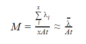
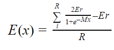

# Location Tracing Overview

## Introduction
This document details the algorithm for detecting COVID-19 exposure risk amongst citizens, primarily achieved through GPS location tracking. This document attempts to explain the overall algorithm from a high-level perspective before breaking it down into its key components (API payloads and database structures). 

## System Requirements
The geo-location tracing application needs to accurately calculate a user’s exposure risk based on their location history. Important to note is that, unlike similar COVID-19 tracing applications, EINS is structurally designed to calculate and feedback an individual's exposure based on their location rather than tracking direct history of contact between an infected person and someone potentially at risk. This component of the application will be dealt with in a separate system. 

The linking of location history and exposure risk must be conducted in such a way that anonymity of all users is preserved, a unique selling point of the product. This implies that of the stored location information, it cannot be linked or associated to a specific user. Therefore, individuals will not be able to be found through location coordinate data that the server holds (unless specifically granted permission being given). This is achieved by ensuring that a user’s location data never leaves the device from which it is generated unless permission is given directly by the user. 

Additionally, the system must be able to manage and handle updates of previously recorded locations. This is because when a new user tests positive, and chooses to donate their data, participating users that have been in the vicinity of this now positive individual should be notified on all data points from when they first became infectious. This allows users to take the necessary precautionary measures. 

In a study completed by the Robert Koch Institute (RKI), an individual is deemed to be infectious for as long as two and half days before displaying symptoms. To err on the side of caution, EINS considers any infected user to have been infectious from three days prior to their confirmed and tested symptoms date. Should a user not have disclosed their status (or be asymptomatic), then they would be considered as infectious as of one week before the positive test result date. Based on the above, and considering the length it may take for a person to get tested and receive test results, a user must be able to check for exposure for up to a minimum of two weeks prior to the current time.

It is expected that the EINS application will gain up to 50 million users. Due to the influx of voluminous data that is expected, it is therefore of vital importance that the system is designed in such a manner where scalability is a seamless operation. Hence, the following key system requirements need to be met:

 - The system must be able to provide a user with an exposure risk based on proximity to known positive users.
 - The system must protect the user’s anonymity.
 - The system must be able to provide information on previously recorded coordinate data for a period of up to two weeks,
 - The system must be able to scale in order to handle increased volumes of traffic data.

## Overview

## Technical Breakdown
This section of the document will delineate the systems technicalities, covering the areas from the database structure right through to the individual processes and endpoint app processing.

### Database Structure
Due to the unavoidable large data sets that will quickly be incurred from high volumes of traffic, the database structure is critical. The correct and sound structure of the EINS database will ensure that upon API requests, processing is seamless and efficient. Please see the database structure below: 

```
Table GeoZoneSpecifications {
  Id long [pk]
  Shape varchar
  LatitudeCoordinateRange decimal 
  LongitudeCoordinateRange decimal
  EstimatedMaxMetreRange integer
}

Table GeoZones {
  Id Guid [pk]
  GeoZoneSpecificationId long [ref: > GeoZoneSpecifications.Id]
  CentreLatitude decimal
  CentreLongitude decimal 
  ParentId Guid [ref: - GeoZones.Id]
}

Table Coordinates{
  Id Guid [pk]
  Latitude decimal 
  Longitude decimal 
  Confidence decimal 
  Timestamp long
}

Table GeoZoneCoordinates{
  Id Guid [pk]
  GeoZoneId Guid [ref: > GeoZones.Id]
  CoordinateId Guid [ref: > Coordinates.Id]
}

Table ArchivedCoordinates{
  Id Guid [pk]
  Latitude decimal
  Longitude decimal
  Confidence decimal 
  EpochTime long
}
```
 - Geo-Zone Specification: This table stores all information about the server’s currently supported zones. Notably, this includes shape and size. In the first iteration, only squares are supported.
 - **Geo-Zone:** This table stores all of the geo-zones across the world. These zones match up to the supported geo-zone specifications in the specification table. It is also permitted for geo-zones to have parent zones that correspond to a zone that the entry sits inside of. 
 - **Coordinates:** This table will store all coordinates that are linked to geo-zones. This table only stores information whilst it is applicable. A job removes all data from this table when it is no longer considered to be relevant for backdating infection risk. The confidence is a value between 0-1 which is returned by the GPS, indicating the likelihood that the data point is at the exact recorded coordinate location.
 - **Archived Coordinates:** This table will store all raw coordinate data that comes into the server. This data is never cleaned and allows for a history of all infected points to be stored.
 - **Geo-Zone Coordinate:** This table represents an association entity between the many-to-many relationship of the coordinates and geo-zones table.

### Logging of Coordinates to Server
In order to calculate a user’s exposure risk, the server will need to have a store of infected data points. The main source of this data will inevitably come from users on the application who have opted to donate their location history once they have tested positive. It is therefore essential that there exists a method set up which will store this data.

#### Requirements
The server only needs to keep track of the coordinates for known COVID-19 positive cases. The input of this data will come from either one of the following sources: 

 - A user shares their historical location data dating back to the start of their infectious period.
 - A user continues to share their daily location data. 
 - External sources such as hospitals, testing laboratories or government institutions may upload coordinates based on recorded cases they have. 

As such, the system must be designed accordingly, ensuring that it can handle data input from these three sources. Given that it will be dealing with large amounts of data that needs to be shared and dealt with within minutes of being allowed to by users, the system must be able to handle and disperse the above sources of data efficiently. 

#### Technical Breakdown of Required Functionality
Coordinate dumps are done through a simple REST endpoint. The structure of the data is as follows, where time is in unix and accuracy sits between 0 and 1:

```
{
     “coords”: [
	{
	     “lat”: 31.324112,
	     “long”: 21.53523,
	     “time”: 1586325456,
	     “accuracy”: 0.8743
	},
	{
	     “lat”: 33.324112,
	     “long”: 27.53523,
	     “time”: 1586325412,
	     “accuracy”: 0.9743
	}
     ]
} 							                    Byte size ~181B(1 entry), ~322B(2 entries).
```

Upon receiving these lists of coordinates, the server will save them directly to the coordinate and archived coordinate tables. Once completed, the server will return a successful response message.

#### Estimation of Payload Size
The method of estimation does not include the size of any overheads. However, the JSON payloads of concern are those with a large ‘body’, resulting in a negligible change due to the payload overhead. The JSON payload size is heavily dependent on the number of items in the coordinate list which, in turn, is dependent on the time between entries as well as the range in the time of entries. The size of each item of the JSON payload is determined so that the size of all possible payloads may be determined.

| Item        | Number of Bytes |
|-------------|-----------------|
| Package     | 40              |
| Coordinates | 141             |

The following equation is used to calculate the size of expected payloads.

 - *Size = ((Coordinates)(Rang of Time) / Time between entries) + Package*

The JSON payload is calculated to be 284.256 KB when assuming the coordinates are captured every 10 minutes. The range of time is 2 weeks and all captured coordinates are transmitted to the API. For a time range of a day the size is found to be 20.30 KB.

### Linking of Coordinates To Geo Zones
In order to improve performance and scalability, the linking of infected coordinate points to the respective geo-zones will be a job that is conducted in the background. This job is triggered according to time and takes all new and unlinked coordinates and processes them.

For each active geo-zone specification, the system calculates what centre point of the corresponding geo zone for the coordinate will be. This is done for each new coordinate. Based upon these calculated centre points, the system attempts to find an already existing geo-zone. Should this zone exist, an entry in the linking table is added. However, should no geo-zone exist, a new geo-zone with the required specifications is created and subsequently a corresponding entry is added to the link table. This process will be run regularly in the background so that up to date and relevant information will be provided when a user seeks to obtain their exposure risk. 

### Calculation of User's Exposure Risk
Once the database has been populated with all of the required data, the user will need to be able to quickly access this through a form that provides ease of use and interpretation. 

#### Requirements
Users of the application are going to want to be updated with their exposure risk information on a frequent basis. Given the ease of transmission of COVID-19, it is vital that users hold relevant knowledge on which locations they should and shouldn’t venture into. Therefore, it is key that the app pulls this information on a regular basis. Importantly, the user’s location information must never be compromised and it is ensured that the location information does not leave the device. This API path represents an integral aspect of the app functionality. 

#### Technical Breakdown of Required Functionality
In order to match the requirements, the following diagram flow is adopted in order to calculate the overall exposure risk of a user. There exist three main components to this process:

 1. The app determines what information it requires from the server and subsequently builds a request. In doing so, it ensures that ‘fake’ data is included to mask the true location of the device.
 2. The server receives the requested information, pulls the infected data points and returns a breakdown of geo-zones as well as their exposure ratings based upon the specified time zones.
 3. The app then links this returned information to its own data points and calculates an overall risk which will then be displayed to the user.
 
 

```
The structure of the request information to the server is as follows:

{
	"returnDataFormatting": {
		"geoZoneSpecId": 4,
		"exposureThreshold": 0,
		"minutePeriod": 10
	},
	"areaRequests": [
		{
			"lat": -33.5249,
			"long": 18.4241,
			"start": 1585963074,
			"end": 1586966674
		},
		{
			"lat": -33.6249,
			"long": 18.3241,
			"start": 1586963074,
			"end": 1586966674
		},
		{
			"lat": -33.7249,
			"long": 18.2241,
			"start": 1586963074,
			"end": 1586966674
		},
		{
			"lat": -33.2249,
			"long": 18.2241,
			"start": 1586963074,
			"end": 1586964274
		},
	]
}						                       Byte Size: ~248B(1 entry), ~368B(2 entries).
```

Where:
 * ReturnDataFormatting details information on how the app intends the exposure data to be returned:
    - GeoZoneSpecificationId indicates the size and shape of the geo-zones that will be returned.
    - exposureThreshold is a percentage value that filters out all results below the specified value.
    - minutesPeriod indicates the granularity of the time periods returned by the server (e.g. A 1-hour period could have 3x20 minute periods or 6x10 minute periods).
 * areaRequests hold information on the requested areas and their time periods:
    - The coordinate values (latitude and longitude) are the centre coordinates of a 0.01 by 0.01 latitude versus longitude square. The server will only search for geo-zones within this area around the specified coordinates
    - The start and end values are unix time that indicate the beginning and end period for which the server must return exposure risk data.

Once processed, the server needs to return the data in an easy-to-handle response. This is structured as follows:

```
{
	"geoZoneSpecId": "4",
	"latRange": 0.0001,
	"longRange": 0.0001,
	"zones": [
		{
			"centreLat": 21.123,
			"centreLong": 31.123,
			"exposures": [
				{
					"start": 174135135,
					"end": 174135155,
					"exposure": 87.32
				},
				{
					"start": 174135155,
					"end": 174135175,
					"exposure": 71.25
				}
			]		
		}
	]
}		            Byte Size: ~386B (1 geoZone and exposureTime), ~485B (1&2), ~596B (2&2)
```

Where:
 * geoZoneSpecId, latRange and longRange all contain information about the geo-zones that are being returned
 * zones contains the zone-specific information:
 * centreLatitude and centreLongitude share information over the location of the geo-zone
 * exposures contains a list of exposure information by time period
    - Exposure is the rating as a percentage
    - start and end indicate the time period as unix timestamps

#### Estimation of Response Data Size
The same method, as previously discussed, will be used to calculate the size of the request, response payloads and the size of each item of the JSON payload.

| Item          | Number of Bytes |
|---------------|-----------------|
| Package       | 128             |
| Area Requests | 120             |

| Item           | Number of Bytes |
|----------------|-----------------|
| Package        | 187             |
| Geo Zones      | 95              |
| Exposure Times | 99              |

The following equations are used to calculate the size of expected payloads respectively:

- *Req. Size =(AreaRequests Size)(No. of AreaRequests)+Package*
- *Rsp. Size =(GeoZones Size)(No. of GeoZones)+(ExposureTimes)(No. of ExposureTimes)+Package*

Assuming an average of 50 areas requested, 10000 geo-zones, and 20 exposure times, the following results are obtained:
 - Request size = 6.128 KB
 - Response size = 20.750 MB

#### Mathematical Calculation of Exposure Risk
Calculating the exposure risk consists of a two-stage process:

1. To calculate the exposure rating of each ‘region’ at a moment in time. Stage 1 of the calculation is performed by the API.  
2. To calculate the exposure risk of a user based on their location relative to known infected zones. Stage 2 of the calculation is performed by the Client App in order to prevent user location data leaving their device.

##### Stage 1: Region Exposure Rating
It is logical to assume that the risk of infection for a given region and time is proportional to the density of infection. To limit the risk factor to an acceptable range, the infection density is mapped to a Sigmoid function.


Remembering that Mx is equal to the density of infection the equation for M can be determined.



Each location has a confidence interval associated with it which ranges between 0-1. In theory, the less the confidence interval of the location, the less it should contribute to the exposure rating of its regions. The magnitude of these effects should also be inversely proportional to the size (area) of the zone. Further, location confidence should also have the inverse effect on surrounding regions, however this is not accounted for in the implemented middle.

##### Stage 2: User Exposure Risk
A user’s coordinates are mapped to the infected regions of known exposure ratings. By using a similar method to Step 1, a Sigmoid function is again to limit the exposure rating to an acceptable range.



Coordinate inaccuracy again determines the equation gradient for the same reasons stated in Step 1.


Due to there being no link between donated infected coordinates and users donating these coordinates, it is not possible to factor in any information related to the infected individuals. This includes information like the stage that the virus is at as well as the level of infection spreading prevention which has been employed. Furthermore, the environment at each infectious location is also not considered, however it could be easily added to the moddle at a later stage.


## System Limitations
As with any system, there do exist limitations as well as operation areas that could be improved. Most notably to this project are the following areas: the inaccuracy of the current geo-zoning system, the inability to account for objects on the ground and the lack of consideration of altitude.

As previously discussed, the current implementation of the block system leads to variation in the block sizes as the zones move further away from the equator. This method was chosen due to its simplicity as well as its speed to implementation. However, in spite of this varying size, this should not detrimentally affect the values of the exposure risks, allowing them to be seriously considered for what they represent. As zones move further away from the equator, a small change in the risk of that zone will be incurred. However, when combined with the fact that this area is one of many areas that combine to give the overall risk, tthe resulting inaccuracy will not prove significant to affect the overall outcome. However, a method of exact precision will be sought for future implementations. 

Additionally, this system cannot take into account real-world objects such as walls, houses and other protective measures. For example, should a user live in an apartment block and their neighbour is positive and self-isolating, it is likely that the app will pick up that user as ‘high-risk’ despite the fact that they have not been in direct contact with that person. However, as the speed at which this virus spreads has been repeatedly made clear, even the boundaries of such an apartment wall does not mean that an individual is not still at risk. Notably, due to the nature in which the virus can linger on surfaces, this system will pick up potential exposure risks that many of the bluetooth collision systems would otherwise not be able to detect. 

## Future Considerations
In order to both overcome some of the limitations and improve upon them, improvements can be adhered to such as:  upgrading of the geo-zone system to account for the nonlinear aspect of longitude, improving the exposure risk calculation and utilising a ‘syncing process’ for the sharing of data instead of the current REST system.

In order to improve on the inaccuracies that the system exhibits, calculations of the zones could occur based on distances measured in metres/kilometres, rather than latitude and longitude. On top of this, each zone would be assigned a unique identifier that would allow for easy communication of zones between the app and server. Also, by changing the shape from a square to a hexagon would keep the distances between the zone centres unique for all zones. This would allow for a more in-depth and powerful calculation to be made. 

The risk calculation, although currently thorough enough to account for time period, area size, coordinate count and coordinate confidence, offers room for improvement. This could be achieved by taking into account neighbouring blocks exposure ratings when calculating a blocks exposure. This would further help in providing a more general exposure risk for a certain area, rather than completely segmenting them into individual blocks. It would assist in managing the effect of coordinate inaccuracies. 

Finally, to improve the efficiency of communication between the app and the server, ‘sync infected information’ between the device and server could be explored. This is in contrast to sharing certain data-sets repeatedly when no changes have occurred. Not only would this increase efficiency, but it would further help to mask the true location of the user as it will be far harder to track what information is being transmitted as a ‘man-in-the-middle’ approach would mean that outside individuals would not know what is currently on the device.

## Conclusion
The ultimate goal of this geo tracing system is to give a calculated COVID-19 exposure risk to an individual user. Whilst there exist bluetooth systems that will be better able to tell a user when they have been in proximity to another positive user, they forego crucial aspects of the way in which the disease spreads. Through EINS, it is far easier to determine a user’s overall risk exposure despite not being able to know if you were in direct contact with individuals, protecting all users' right to privacy. This is achieved by utilising information on both proximity to contagious users as well as indirect exposure through the virus remaining on surfaces after a contagious person has been in the area.
